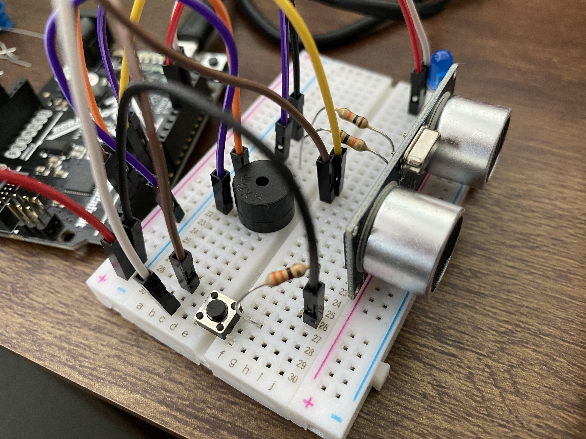

# Ultrasonic Sensor Project
A repo holding an old project done on a CircuitPython microcontroller using an ultrasonic sensor and other electronic components. This was done in my first year of college, when I was still unfamiliar with GitHub and Git.

Here is a picture of the physical design, containing an ultrasonic sensor and feedback systems in the form of an LED and a piezo buzzer:

Assembled as shown, and with the .py code file in this repo, the device detects the distance from itself to any objects in the path of the ultrasonic sensor. If there is any such object relatively close by, the LED will light up and the piezo will buzz. Any change in distance results in a change in pitch of the piezo buzzer; an increase in distance results in an increase in frequency (pitch), and vice versa. If one gets too far away, the LED will dim and eventually shut off, with a similar response as the piezo buzzer to distance changes. A demo video is included in this repo, as a .mov file that is 1 minute long.
